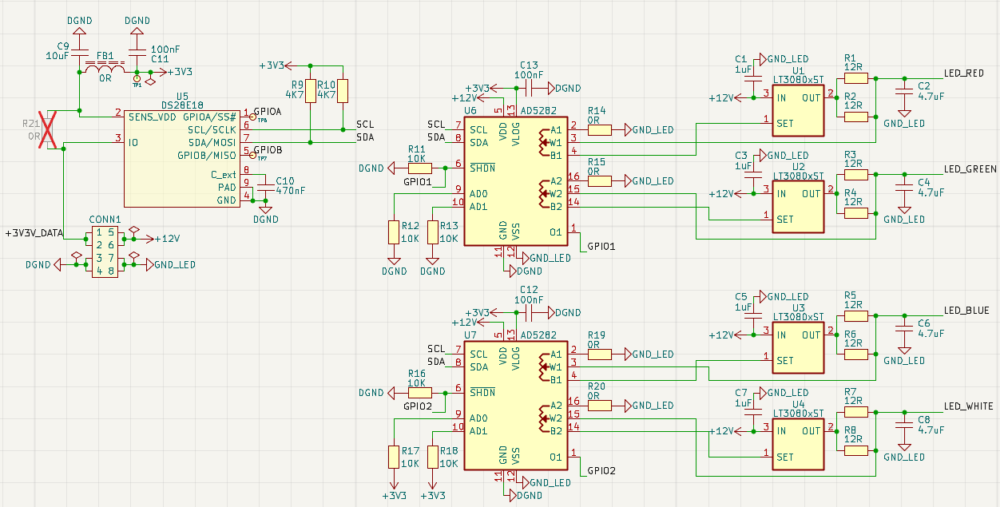
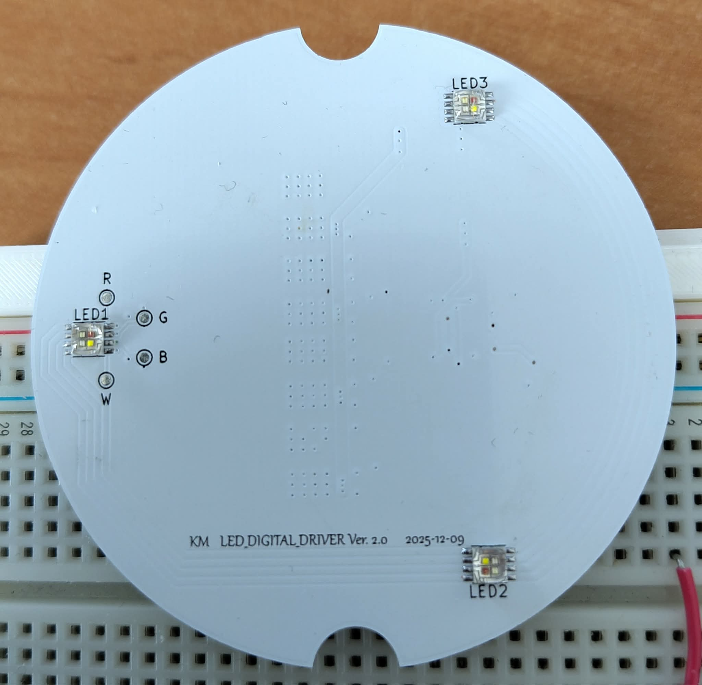
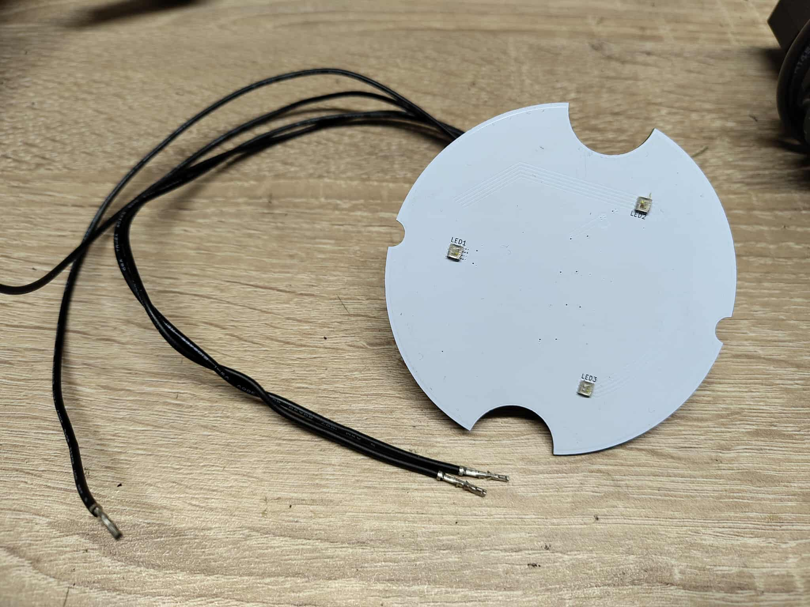

## 1. Wstęp
Sterownik umożliwia precyzyjną regulację jasności i koloru diod LED poprzez potencjometry cyfrowe, zasilany stabilnym napięciem prądowym. Całość jest zarządzana poprzez mikrokontroler napisany w C w środowisku VS Code, z wykorzystaniem HAL i własnych bibliotek sterujących.
Dodatkowo projekt implementuje komunikację **1‑Wire** z mikrokontrolera STM32 za pośrednictwem mostka komunikacyjnego **DS28E18**. Rozwiązanie to pozwala w prosty sposób przesyłać dane sterujące przy użyciu pojedynczej linii sygnałowej, co znacznie upraszcza topologię połączeń i redukuje liczbę wymaganych pinów na mikrokontrolerze. Dzięki temu możliwe jest tworzenie skalowalnych i estetycznych instalacji, w których cała komunikacja opiera się o zaledwie jedną linię transmisyjną oraz masę.

## 2. Opis PCB i kluczowych elementów
Płytka została zaprojektowana w oparciu o sprawdzone układy scalone i elementy dyskretne.  
Kluczowe elementy:
- ~**MCP43X1** – cyfrowy potencjometr, umożliwiający precyzyjne ustawianie parametrów pracy prądowej i kolorów.~

W trakcie testowania urządzenia okazało się że napięcie sterujące stabilizatorem przekracza napięcie zasilania układu. Rozwiązaniem jest zmiana układu MCP43X1 na układ AD5282. Ma on dwa wejścia zasilania. Pierwsze jest dla napięcia 3.3V do sterowania komunikacją i logiką, drugie wejście dla napięcia współpracujące z rezystorami wewnętrznymi, które w tym projekcie wynosi 12V.
- **LT3080** – liniowe stabilizatory napięcia zapewniające wysoką stabilność zasilania.
- **DS28E18** – konwerter/mostek komunikacyjny, umożliwiający elastyczne połączenia i uproszczenie topologii.
- Rezystory mocy do ograniczania i stabilizacji prądów w obwodach LED.  

PCB zostało zaprojektowane jako niewielka dwustronna płytka, co ułatwia produkcję i testowanie. Zdjęcia starej wersji sterownika

## 3. Oprogramowanie
Sterowanie układem realizuje mikrokontroler **STM32**, dla którego przygotowano oprogramowanie w języku **C**.  
Projekt tworzony był w środowisku **Visual Studio Code** z wykorzystaniem rozszerzeń wspierających STM32 oraz konfiguratora **STM32CubeMX**.  

Komunikacja z mostkiem **DS28E18** odbywa się przy użyciu magistrali **1‑Wire**, obsługiwanej w trybie *Single Wire (Half‑Duplex)* wbudowanym w STM32. Mostek pełni rolę tłumacza pomiędzy interfejsem 1‑Wire a magistralą **I²C**, do której podłączone są cyfrowe potencjometry.  

Proces działania wygląda następująco:  
1. Mikrokontroler inicjalizuje komunikację 1‑Wire i konfiguruje mostek DS28E18.  
2. Do mostka przesyłana jest sekwencja poleceń I²C, które określają wartości potencjometrów.  
3. Sekwencja zostaje zapisana w pamięci wewnętrznej mostka.  
4. Po wywołaniu przez STM32, DS28E18 samodzielnie odtwarza tę sekwencję na magistrali I²C, dzięki czemu możliwe jest precyzyjne sterowanie parametrami pracy LED.  

Takie rozwiązanie pozwala znacząco uprościć okablowanie (pojedyncza linia danych + masa), a jednocześnie zachować elastyczność sterowania wieloma elementami z poziomu mikrokontrolera.

---

## 5. Dalszy rozwój projektu
Planowane kierunki rozwoju obejmują:
- Implementację zaawansowanych efektów świetlnych (fade, smooth transitions).  
- Dodanie modułu komunikacji bezprzewodowej (Bluetooth Low Energy lub Wi-Fi).  
- Dołączenie ekranu i wybór koloru świecenia poprzez mapę kolorów. 
